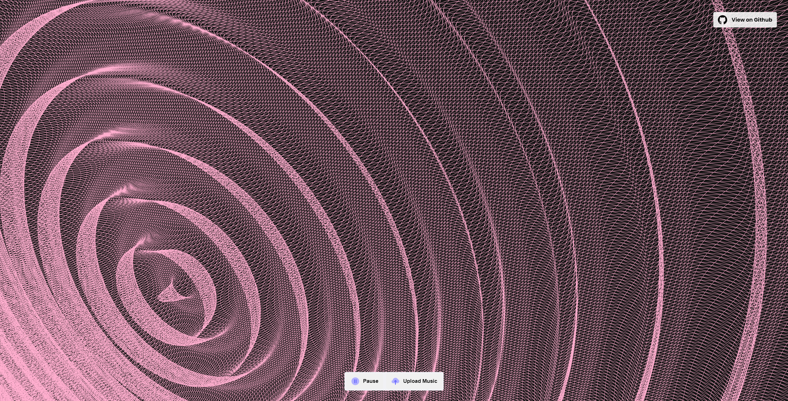

# [3DMusicVisualizer](https://lnardon.github.io/3DMusicVisualizer/)

A 3D music visualizer that interacts with the music using Three.js and custom GLSL shaders.

  

### What was used

- Javascript
- Three.js
- GLSL Custom Shader
- WebAudio API
- HTML/CSS

##### Special thanks to: https://discourse.threejs.org/t/how-to-save-the-exact-position-of-camera/26815/3 :heart:
